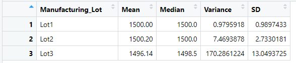
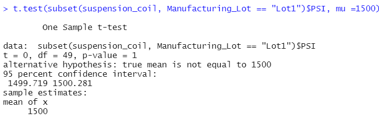
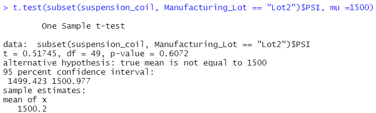
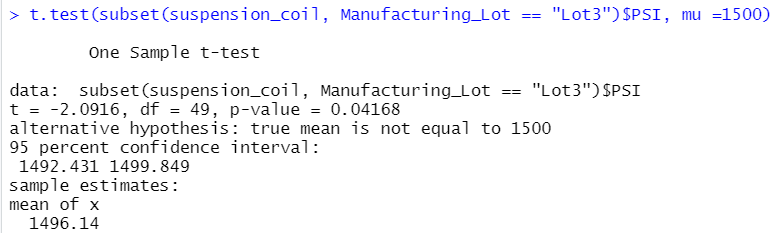

## Linear Regression to Predict MPG 
Using R, a linear model was designed to see if any of the following metrics could predict the MPG of MechaCar prototypes:
* vehicle length
* vehicle weight
* spoiler angle
* drivetrain
* ground clearance
  
Below is a screenshot of the multiple linear regression results: 

The only 2 variables/coefficients that provided a non-random amount (p-value< .05) of variance to the mpg values in the dataset, were the following:

1. Vehicle Length with p-value of 2.60e-12 
2. Ground Clearance with p-value of 5.21e-08  
 **Vehicle weight was close with a p-value of 0.0776*

 The slope of the model is not considered to be zero since the Multiple R-squared (0.7149) and Adjusted R-Squared (0.6825) both show the model is a good predictor (>0.5). However, the following had individual slopes that were close to zero:
 * Vehicle_weight had a slope of 1.245e-03
 * Spoiler_angle had a slope of 6.877e-02

This multiple linear regression model is a "somewhat '' good predictor to predict mpg of MechaCar prototypes since the R-squared values are both higher than 0.5 and the p-value of 5.35e-11 is less than 0.05.  

However, I feel that looking at each metric individually compared to MPG can give a better predictor.  The following shows each metric with a "singular" linear regression model, along with each R-squared and  p-value:

It is interesting to notice that both vehicle_length and groud_clearance both visually show the correlation between the metric and MPG. 

## Summary Statistics on Suspension Coils 

The design specifications for the MechaCar suspension coils dictate that the variance of the suspension coils must not exceed 100 pounds per square inch. 
When looking at all the data together, the variance is only 62.29356 (which does not exceed 100).  This seems like it meets the specifications as seen below:

However if we take a closer look and separate each lot individually, we see a different picture:

* Lot 1 & Lot 2 has a very small variance that more than meets the requirements with variances of 0.9795918 and 7.4693878 respectively.
* Lot 3 very much exceeds the 100 pounds per square with a variance of 170.2861224

## T-Tests on Suspension Coils
### T-test for ALL Lots
A t-test was first written to determine if the PSI across all manufacturing lots was statistically different from the population mean of 1500 pounds per square inch.  Below are the results:

 Assuming our significance level was the common 0.05 percent, our p-value is above our significance level. Therefore, we do not have sufficient evidence to reject the null hypothesis, and we would state that the two means are statistically similar.

 ### T-Test for Lot 1
 Here is the t-test result comparing only Lot 1 to the population mean:

 
 This shows that the p-value = 1, which means that the 2 means are identical! Again, we do not have sufficient evidence to reject the null hypothesis, and instead we would state that the two means are statistically similar. 

 ### T-Test for Lot 2
Here is the t-test result comparing only Lot 2 to the population mean:

 
 This shows that the p-value = .6072, which is greater than 0.05. Yet again, we do not have sufficient evidence to reject the null hypothesis, and instead we would state that the two means are statistically similar. 

 ### T-Test for Lot 3
 Here is the t-test result comparing only Lot 3 to the population mean:

 
 This shows that the p-value = .04168 which is less than 0.05. This time, we would reject the null hypothesis, and state that the two means are statistically different. 

 ## Study Design: MechaCar vs Competition
 In order to compare performance of the MechaCar vehicles against performance of vehicles from other manufacturers, another statistical study should be performed.  

 I would look at the following metric to compare MechCar vs Competition:
 * City fuel efficiency
 
I would first do summary statistics on fuel efficiency for both MechaCar and the competition.

Next, I would formulate the hypothesis:  
* Ho: There is no difference between the means of the MechaCar  and the competition fuel efficiency data.
* Ha: There is a difference between the means of the MechaCar  and the competition fuel efficiency data.

Then I would do a 2-sample t-test to test the hypothesis because they are samples from 2 different groups.

The data I would need would have to have the city fuel efficiency for the 50 prototype MechaCars and also for 50 competition cars.
