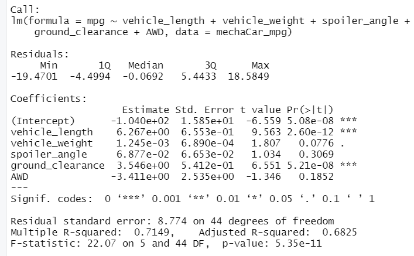
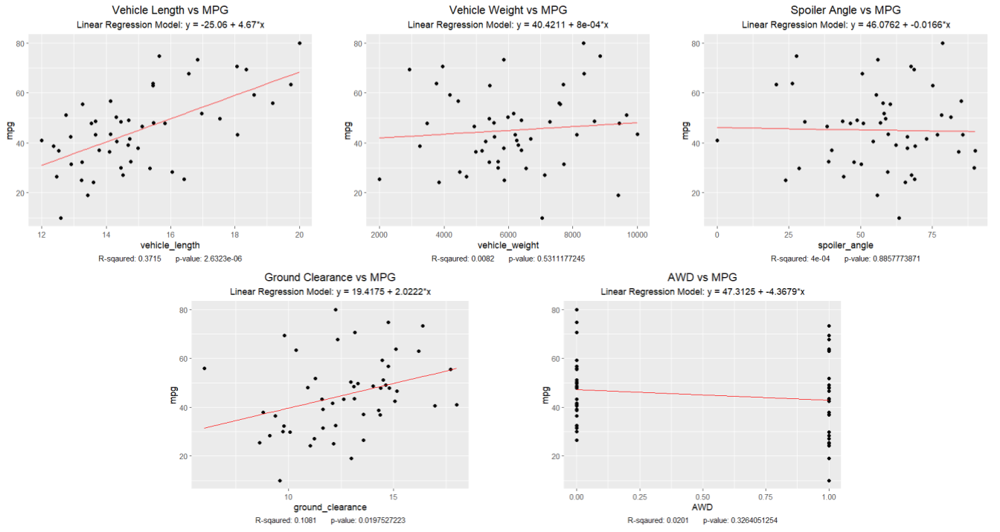

# MechaCar_Statistical_Analysis

## Linear Regression to Predict MPG (Deliverable #1)
Using R, a linear model was designed to see if any of the following metrics could predict the MPG of MechaCar prototypes:
* vehicle length
* vehicle weight
* spoiler angle
* drivetrain
* ground clearance
  
Below is a screenshot of the multiple linear regression results: 

The only 2 variables/coefficients that provided a non-random amount (p-value< .05) of variance to the mpg values in the dataset, were the following:

1. Vehicle Length with p-value of 2.60e-12 
2. Ground Clearance with p-value of 5.21e-08  
 **Vehicle weight was close with a p-value of 0.0776*

 The slope of the model is not considered to be zero since the Multiple R-squared (0.7149) and Adjusted R-Squared (0.6825) both show the model is a good predictor (>0.5). However, the following had individual slopes that were close to zero:
 * Vehicle_weight had a slope of 1.245e-03
 * Spoiler_angle had a slope of 6.877e-02

This multiple linear regression model is a "somewhat '' good predictor to predict mpg of MechaCar prototypes since the R-squared values are both higher than 0.5 and the p-value of 5.35e-11 is less than 0.05.  

However, I feel that looking at each metric individually compared to MPG can give a better predictor.  The following shows each metric with a "singular" linear regression model, along with each R-sqaured and  p-value:

## Summary Statistics on Suspension Coils (Deliverable #2)

### The design specifications for the MechaCar suspension coils dictate that the variance of the suspension coils must not exceed 100 pounds per square inch. Does the current manufacturing data meet this design specification for all manufacturing lots in total and each lot individually? Why or why not?